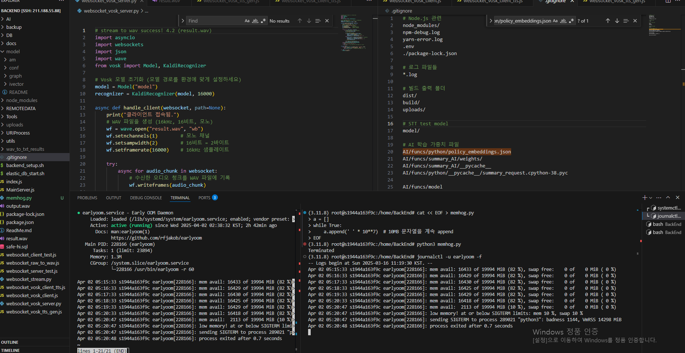

# 프로젝트 개요

이 프로젝트는 AI, 데이터베이스(DB), 및 원격 데이터(Remote Data) 모듈과 통신하는 Node.js 서버로 구성되어 있습니다. 각각의 기능은 `URIProcess/`에서 정의된 라우팅에 따라 요청을 처리하며, 모듈별(AI_URI_Process / DB_URI_Process / RD_URI_Process)로 별도의 라우팅 파일이 분리되어 관리됩니다.

# 4.17 STT_AI Management server
```
pm2 start python3 --name STT_AI -- -u /new_data/sw_excellent/BackEnd/AI/funcs/stt_AI/server.py
pm2 start /new_data/sw_excellent/BackEnd/MainServer_STT_Manage.js --name STT-manage-server
// 이후 아래 링크 접속
```
http://211.188.55.88:23030/

## MainServer.js Dependency
``` bash
# python dependency
python3 -m venv .venv
source .venv/bin/activate
```

## Disk ManageMent
```bash
# Disk 용량 확인
df -ah

# 용량 큰 파일 확인인
sudo du -ah /경로 | sort -rh | head -n 20
# 예시
sudo du -ah /home | sort -rh | head -n 20

# 심볼릭 링크로 연결 (예시)
sudo ln -s /mnt/a/models/whisper_full_model.pkl ./whisper_full_model.pkl

```

## RAM (OOM) Management
earlyoom -> RAM 과다 사용 process 강제종료
```bash
sudo apt update
sudo apt install earlyoom

systemctl status earlyoom

sudo vim /etc/default/earlyoom
# (Option) 위 커맨드 후 아래 변수 아래와 같이 수정
# 기본 설정에서는 RAM < 10% 또는 SWAP < 10%일 때 가장 많은 메모리를 사용한 프로세스를 종료

EARLYOOM_ARGS="-r 5 -m 15 -s 10"
# -m 15: 메모리 사용률이 15% 미만이면 작동
# -s 10: 스왑이 10% 미만이면 작동
# -r 5: 5초 간격으로 검사

# linux service 활성화
sudo systemctl enable --now earlyoom

# system 상태확인
systemctl status earlyoom
# 동작 중이어야 하고, 로그에 mem avail: ~% 같은 메시지가 찍히고 있어야 함

# log 확인
journalctl -u earlyoom -f
```
테스트용 OOM 유발 코드 (memhog.py)
```python
a = []
while True:
    a.append(' ' * 10**7)  # 10MB 문자열을 계속 append
EOF
```



## 디렉토리 구조

```
├── ReadMe.md
├── AI
│   ├── ai_api.js
│   └── funcs
│       ├── call_ai_func_using_localfunc.js
│       ├── call_ai_func_using_web.js
│       └── index.js
├── DB
│   ├── db_api.js
│   └── funcs
│       └── db_query_app.js
├── REMOTEDATA
│   ├── funcs
│   │   └── ex_TBD.js
│   └── remote_data_api.js
├── Tools
│   ├── Client
│   │   └── test_client
│   │       └── index.html
│   └── example_python_func
│       └── helloworld.py
├── index.js
├── MainServer.js
└── URIProcess
    ├── AI_URI_Process.js
    ├── DB_URI_Process.js
    └── RD_URI_Process.js
```

## 주요 파일 및 디렉토리 설명
### 1. **`MainServer.js`**
   - 이 파일은 서버의 진입점(entry point)입니다.
   - Express.js를 사용하여 AI, DB, Remote Data 모듈에 대한 요청을 처리하는 기본 설정이 포함되어 있습니다.
   - 클라이언트의 접속요청을 받아주고 약속된 [URI(
Uniform Resource Identifier)](https://en.wikipedia.org/wiki/Uniform_Resource_Identifier) 에 따라 지정된 요청에 따른 동작을 수행하고 결과를 반환해줍니다.
   - 각각의 모듈에 대한 라우팅은 `URIProcess` 디렉토리에 분리되어 있습니다.

### 2. **`URIProcess/`**
   - 이 디렉토리는 각 모듈(AI, DB, Remote Data)의 라우팅을 담당합니다.
   - **`AI_URI_Process.js`**: AI 모듈에 대한 API 요청을 처리합니다. `ai_api.js`에서 정의된 AI 관련 함수들을 호출합니다.
   - **`DB_URI_Process.js`**: DB 모듈에 대한 API 요청을 처리합니다. `db_api.js`데이터베이스 관련 작업을 수행합니다.
   - **`RD_URI_Process.js`**: Remote Data 모듈에 대한 API 요청을 처리합니다. `rb_api.js`원격 데이터 관련 함수들을 호출합니다.

### 3. Module Directorys
   - AI/ DB/ REMOTEDATA/ 디렉터리 안에 해당 기능에 대한 실제 코드들이 구현되어있습니다.
   - 아래에서 내용이 이어집니다.

#### 3-1. **`AI/`**
   - 이 디렉토리는 AI와 관련된 코드의 구현이 포함되어 있습니다.
   - **`ai_api.js`**: python으로 구현된 AI 모듈에 요청을 보내는 기능이 구현되어있습니다. 요청은 동일한 기기에 존재하는 파이썬 스크립트(local)와 원격지에서 존재하고있는 파이썬 스크립트(remote) 두가지로 나누어 보내는 것이 가능합니다.
   - **`funcs/`**: Remote Data 모듈에서 사용할 함수들이 여기에 저장됩니다. 추가적인 기능을 구현할 수 있는 자리입니다.

#### 3-2. **`DB/`**
   - 이 디렉토리는 DB 관련된 코드들이 포함되어 있습니다.
   - **`db_api.js`**: DB에 쿼리할 수 있는 로직이 포함되어 있습니다.
   - **`funcs/`**: Remote Data 모듈에서 사용할 함수들이 여기에 저장됩니다. 추가적인 기능을 구현할 수 있는 자리입니다.

#### 3-3. **`REMOTEDATA/`**
   - 이 디렉토리는 원격 데이터 모듈과 관련된 코드들이 포함되어 있습니다.
   - **`rd_api.js`**: 원격 데이터와 통신하는 로직이 포함되어 있습니다.
   - **`funcs/`**: Remote Data 모듈에서 사용할 함수들이 여기에 저장됩니다. 추가적인 기능을 구현할 수 있는 자리입니다.

### 4. **`Tools/`**
   - 이 디렉토리는 클라이언트 테스트 및 예시 Python 함수(for AI) 등이 포함되어 있습니다.
   - **`Client/test_client/`**: 간단한 웹 클라이언트 페이지로, Node.js 서버로 요청을 보낼 수 있는 HTML 파일(`index.html`)이 포함되어 있습니다.
   - **`example_python_func/`**: Python 함수를 테스트할 수 있는 예시 코드가 포함된 디렉토리입니다.
     - **`helloworld.py`**: 간단한 "Hello World" 출력을 위한 Python 예시 스크립트입니다.

### 5. **`ReadMe.md`**
   - 이 문서는 프로젝트 구조와 각 파일의 역할을 설명합니다.
   - 다른 개발자들이 이 프로젝트를 빠르게 이해하고 작업을 시작할 수 있도록 가이드 역할을 합니다.

## 서버 실행 방법

1. **Node.js 서버 실행**
   - 프로젝트 루트에서 다음 명령어를 사용하여 서버를 실행할 수 있습니다.
     ```bash
     node MainServer.js
     ```

2. **클라이언트 테스트**
   - `Tools/Client/test_client/index.html` 파일을 브라우저에서 열어 클라이언트 테스트를 진행할 수 있습니다.
   - 각각의 버튼을 눌러 서버의 AI, DB, Remote Data 모듈에 대한 요청을 보낼 수 있습니다.

2-1. **직접 URI 보내 테스트**
   - MainServer.js를 실행한 기기에서 아래와 같이 브라우저에서 직접 URI를 호출해 기능을 테스트할 수 있습니다.
   ```
        http://127.0.0.1:23000/ai/runlocalfunc
   ```


3. **doker**
   - 다음 명령어로 실행
   docker rm -f yangcheon-fe-test 2>/dev/null || true
   ```
      docker run -d --name yangcheon-fe-test \
      -p 28080:20080 \
      -p 28443:28443 \
      -v /new_data/sw_excellent/Yangcheon-FE/deploy/nginx.conf:/etc/nginx/conf.d/default.conf:ro \
      -v /new_data/sw_excellent/Yangcheon-FE/certbot-etc/live:/etc/letsencrypt/live:ro \
      -v /new_data/sw_excellent/Yangcheon-FE/certbot-etc/archive:/etc/letsencrypt/archive:ro \
      --health-cmd='wget -qO- http://127.0.0.1:20080/healthz || exit 1' \
      --health-interval=30s --health-timeout=3s --health-start-period=10s \
      yangcheon-fe-web:test
   ```


## 앞으로 추가할 기능
- 각 모듈별로 함수들을 추가하여 AI, DB, Remote Data와의 통신을 강화할 예정입니다.
- 클라이언트와의 상호작용을 개선하기 위해 추가적인 테스트 페이지 및 응답 처리 로직을 개선할 계획입니다.

  참고) SAFE-HI slack과 연결되어있습니다

## 패치노트
(25.2.6) uploads/ 의 wav 파일이 잘못된 형식으로 uploads 되는경우 ffmpeq을 이용한 보정
1. FFmpeg를 사용하여 파일이 정상적인 오디오 파일인지 확인
```bash
ffmpeg -i /new_data/sw_excellent/BackEnd/uploads/1738817342831.wav
```
만약 오류가 발생하면, 해당 파일이 손상되었거나 올바른 WAV 파일이 아님.

2. FFmpeg로 올바른 WAV 파일로 변환
```bash
ffmpeg -i /new_data/sw_excellent/BackEnd/uploads/1738817342831.wav -acodec pcm_s16le -ar 16000 -ac 1 /new_data/sw_excellent/BackEnd/uploads/fixed_au
```

# start_service.sh
우리 서버가 동작하려면 반드시 5개의 컴포넌트가 실행되어야한다.
1) ollama (gemma)
2) Elastic Search DB
3) MainServer.js
4) STT model & ws Server
5) Embedding model & flaks Server
<br>
=> MainServer.js 에서 4) 5)는 자동으로 켜준다.

```bash
#!/bin/bash

# Ollama 중복 실행 방지
if pgrep -f "ollama serve" > /dev/null; then
    echo "[!] Ollama is already running."
else
    echo "[+] Starting Ollama..."
    export OLLAMA_MODELS=/mnt/a/ollama_data/models
    nohup ollama serve > /mnt/a/ollama_log.txt 2>&1 &
fi

# Elasticsearch 중복 실행 방지
if pgrep -f elasticsearch > /dev/null; then
    echo "[!] Elasticsearch is already running."
else
    echo "[+] Starting Elasticsearch..."
    cd /mnt/a/elastic/elasticsearch-8.17.1
    ./bin/elasticsearch -d
fi

# Node.js Mainserver 중복 실행 방지
if pm2 list | grep -q "Mainserver"; then
    echo "[!] Mainserver.js is already managed by pm2."
else
    echo "[+] Starting Mainserver.js with pm2..."
    pm2 start MainServer.js --name Mainserver
fi
```
