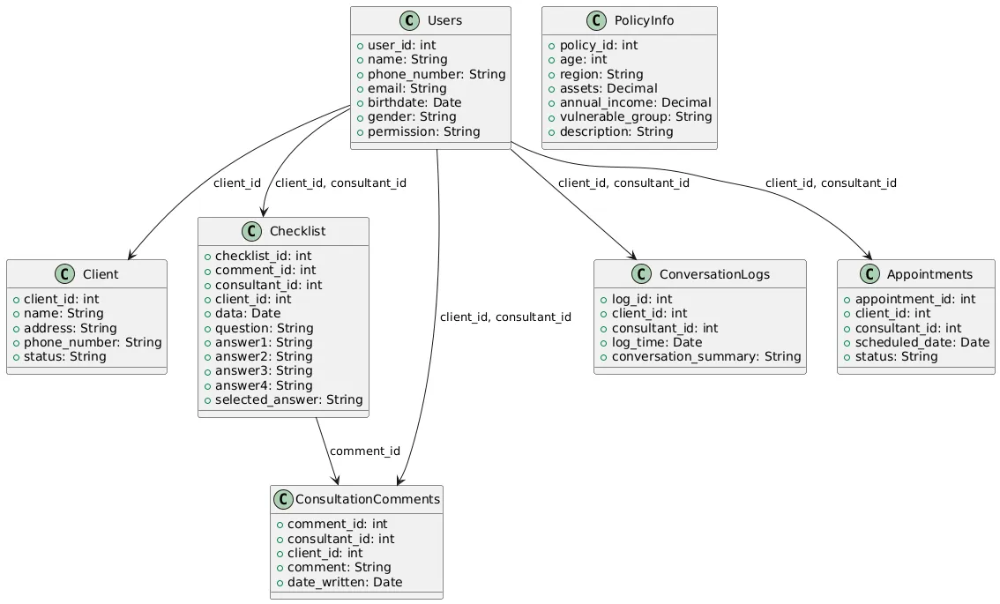
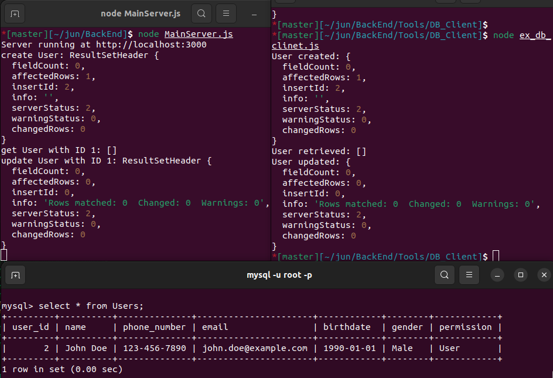

# SafeHi-DB schema


**Users**

- 유저정보 (안심하이 사용자 - 상담가)

**Client**

- 설명 : 등록된 노인정보 Users 에서 사용하는 client_id를 본 테이블 에서 참조.
- 이름 / 거주지 / 전화번호 / status

**PolicyInfo**

- 설명 :  복지정책정보 - 자격 불일치 여부로 제거하는 식으로 설계 (1차개발)
- 나이 / 거주지역 / 자산 / 부부합산연소득 / 취약계층분류(부양가족 및 기초생활수급자, 차상위계층, 한부모가정 중 세대주 및 세대원 전원이 무주택자)

**WelfarePolicy**
- (11.4 Added)


### Revies History
- 2024.10.19 first commit
- 2024.11.4 welfarepolicy table Added
 - To Be Exceed..

### UML
- Actually, "MySQL Query" is not important. "UML" is really  important. it means "DB Design"
- we can make UML using below code.
- use this link : https://www.planttext.com/#google_vignette

```
@startuml
entity "Users" as U {
  +user_id: int
  +name: String
  +phone_number: String
  +email: String
  +birthdate: Date
  +gender: String
  +permission: String
}

entity "Client" as C {
  +client_id: int
  +name: String
  +address: String
  +phone_number: String
  +status: String
}

entity "PolicyInfo" as P {
  +policy_id: int
  +age: int
  +region: String
  +assets: Decimal
  +annual_income: Decimal
  +vulnerable_group: String
  +description: String
}

entity "Checklist" as CL {
  +checklist_id: int
  +comment_id: int
  +consultant_id: int
  +client_id: int
  +data: Date
  +question: String
  +answer1: String
  +answer2: String
  +answer3: String
  +answer4: String
  +selected_answer: String
}

entity "ConsultationComments" as CC {
  +comment_id: int
  +consultant_id: int
  +client_id: int
  +comment: String
  +date_written: Date
}

entity "ConversationLogs" as L {
  +log_id: int
  +client_id: int
  +consultant_id: int
  +log_time: Date
  +conversation_summary: String
}

entity "Appointments" as A {
  +appointment_id: int
  +client_id: int
  +consultant_id: int
  +scheduled_date: Date
  +status: String
}

C -- CL : client_id
U -- CL : consultant_id
CL -- CC : comment_id
C -- L : client_id
U -- L : consultant_id
C -- A : client_id
U -- A : consultant_id
C -- P : client_id
@enduml

```

# SAFEHI-DB MySQL Query

MySQL 쿼리문을 작성하여 UML 다이어그램에 맞게 DB 테이블을 생성. <br>
다음은 UML에 기반한 테이블 생성 쿼리 (2024.10.19):

```sql
CREATE DATABASE IF NOT EXISTS ConsultantDB;
USE ConsultantDB;

-- Users table
CREATE TABLE Users (
    user_id INT AUTO_INCREMENT PRIMARY KEY,
    name VARCHAR(100),
    phone_number VARCHAR(20),
    email VARCHAR(100),
    birthdate DATE,
    gender VARCHAR(10),
    permission VARCHAR(50)
);

-- Client table
CREATE TABLE Client (
    client_id INT AUTO_INCREMENT PRIMARY KEY,
    name VARCHAR(100),
    address VARCHAR(255),
    phone_number VARCHAR(20),
    status VARCHAR(50)
);

-- PolicyInfo table
CREATE TABLE PolicyInfo (
    policy_id INT AUTO_INCREMENT PRIMARY KEY,
    age INT,
    region VARCHAR(100),
    assets DECIMAL(15,2),
    annual_income DECIMAL(15,2),
    vulnerable_group VARCHAR(50),
    description TEXT
);

-- Checklist table
CREATE TABLE Checklist (
    checklist_id INT AUTO_INCREMENT PRIMARY KEY,
    comment_id INT,
    consultant_id INT,
    client_id INT,
    data DATE,
    question TEXT,
    answer1 VARCHAR(255),
    answer2 VARCHAR(255),
    answer3 VARCHAR(255),
    answer4 VARCHAR(255),
    selected_answer VARCHAR(255),
    FOREIGN KEY (comment_id) REFERENCES ConsultationComments(comment_id),
    FOREIGN KEY (consultant_id) REFERENCES Users(user_id),
    FOREIGN KEY (client_id) REFERENCES Client(client_id)
);

-- ConsultationComments table
CREATE TABLE ConsultationComments (
    comment_id INT AUTO_INCREMENT PRIMARY KEY,
    consultant_id INT,
    client_id INT,
    comment TEXT,
    date_written DATE,
    FOREIGN KEY (consultant_id) REFERENCES Users(user_id),
    FOREIGN KEY (client_id) REFERENCES Client(client_id)
);

-- ConversationLogs table
CREATE TABLE ConversationLogs (
    log_id INT AUTO_INCREMENT PRIMARY KEY,
    client_id INT,
    consultant_id INT,
    log_time DATE,
    conversation_summary JSON
);

-- Appointments table
CREATE TABLE Appointments (
    appointment_id INT AUTO_INCREMENT PRIMARY KEY,
    client_id INT,
    consultant_id INT,
    scheduled_date DATE,
    status VARCHAR(50),
    FOREIGN KEY (client_id) REFERENCES Client(client_id),
    FOREIGN KEY (consultant_id) REFERENCES Users(user_id)
);

CREATE TABLE WelfarePolicies (
    id INT AUTO_INCREMENT PRIMARY KEY,
    age INT,
    region VARCHAR(100),
    non_duplicative_policies TEXT,
    policy_name VARCHAR(255),
    short_description TEXT,
    detailed_conditions TEXT,
    link VARCHAR(255)
);

```
예시 데이터 삽입
```sql
-- Users table 예시 데이터
INSERT INTO Users (name, phone_number, email, birthdate, gender, permission) VALUES
('Alice Johnson', '123-456-7890', 'alice.johnson@example.com', '1990-05-15', 'Female', 'Admin'),
('Bob Smith', '234-567-8901', 'bob.smith@example.com', '1985-08-20', 'Male', 'User'),
('Charlie Brown', '345-678-9012', 'charlie.brown@example.com', '1975-11-30', 'Male', 'Consultant'),
('Diana Prince', '456-789-0123', 'diana.prince@example.com', '1988-01-22', 'Female', 'Consultant'),
('Evan Lee', '567-890-1234', 'evan.lee@example.com', '1992-03-14', 'Male', 'Admin');

-- Client table 예시 데이터
INSERT INTO Client (name, address, phone_number, status) VALUES
('Acme Corp', '123 Business Rd, Suite 200', '321-654-0987', 'Active'),
('Tech Innovators', '456 Tech Blvd, 3rd Floor', '432-765-1098', 'Inactive'),
('Green Solutions', '789 Green St, Apt 101', '543-876-2109', 'Active'),
('Future Ventures', '101 Future Ave', '654-987-3210', 'Pending'),
('Global Partners', '202 Global Ln', '765-098-4321', 'Active');

-- PolicyInfo table 예시 데이터
INSERT INTO PolicyInfo (age, region, assets, annual_income, vulnerable_group, description) VALUES
(30, 'Seoul', 50000.00, 45000.00, 'Single Parent', 'Policy for single parents under age 35'),
(45, 'Busan', 80000.00, 60000.00, 'Disabled', 'Financial aid for disabled individuals in Busan'),
(55, 'Incheon', 30000.00, 40000.00, 'Elderly', 'Support for low-income elderly citizens'),
(40, 'Daejeon', 70000.00, 50000.00, 'Low Income', 'Policy for individuals with low annual income'),
(60, 'Sejong', 60000.00, 35000.00, 'Elderly', 'Welfare policy for elderly residents in Sejong');

-- Checklist table 예시 데이터
INSERT INTO Checklist (comment_id, consultant_id, client_id, data, question, answer1, answer2, answer3, answer4, selected_answer) VALUES
(1, 3, 1, '2024-11-01', 'Are you satisfied with the consultation?', 'Yes', 'No', 'Somewhat', 'N/A', 'Yes'),
(2, 4, 2, '2024-11-02', 'Did you find the information helpful?', 'Yes', 'No', 'Somewhat', 'N/A', 'Somewhat'),
(3, 3, 3, '2024-11-03', 'Will you recommend us?', 'Definitely', 'Maybe', 'No', 'N/A', 'Definitely'),
(4, 4, 4, '2024-11-04', 'Is there anything we could improve?', 'Yes', 'No', 'Maybe', 'N/A', 'Yes'),
(5, 3, 5, '2024-11-05', 'Would you like a follow-up?', 'Yes', 'No', 'Not Sure', 'N/A', 'Yes');

-- ConsultationComments table 예시 데이터
INSERT INTO ConsultationComments (consultant_id, client_id, comment, date_written) VALUES
(3, 1, 'Very positive experience, provided valuable information.', '2024-11-01'),
(4, 2, 'Client was satisfied with the answers given.', '2024-11-02'),
(3, 3, 'Suggested policy changes for better benefits.', '2024-11-03'),
(4, 4, 'Discussed potential investment strategies.', '2024-11-04'),
(3, 5, 'Consultation focused on welfare eligibility.', '2024-11-05');

-- ConversationLogs table 예시 데이터
INSERT INTO ConversationLogs (client_id, consultant_id, log_time, conversation_summary) VALUES
(1, 3, '2024-11-01', JSON_OBJECT('summary', 'Discussed various welfare policies')),
(2, 4, '2024-11-02', JSON_OBJECT('summary', 'Explained eligibility criteria')),
(3, 3, '2024-11-03', JSON_OBJECT('summary', 'Advised on financial planning')),
(4, 4, '2024-11-04', JSON_OBJECT('summary', 'Provided investment options')),
(5, 3, '2024-11-05', JSON_OBJECT('summary', 'Reviewed welfare application process'));

-- Appointments table 예시 데이터
INSERT INTO Appointments (client_id, consultant_id, scheduled_date, status) VALUES
(1, 3, '2024-11-10', 'Scheduled'),
(2, 4, '2024-11-12', 'Completed'),
(3, 3, '2024-11-14', 'Pending'),
(4, 4, '2024-11-16', 'Cancelled'),
(5, 3, '2024-11-18', 'Scheduled');

-- WelfarePolicies table 예시 데이터
INSERT INTO WelfarePolicies (age, region, non_duplicative_policies, policy_name, short_description, detailed_conditions, link) VALUES
(30, 'Seoul', 'Yes', 'Youth Housing Assistance', 'Housing aid for young adults in Seoul', 'Must be under age 35 and have no housing', 'http://example.com/policy1'),
(45, 'Busan', 'No', 'Senior Care Support', 'Financial support for seniors in Busan', 'Must be age 45 or older and registered in Busan', 'http://example.com/policy2'),
(60, 'Incheon', 'Yes', 'Low-income Elderly Benefits', 'Benefits for elderly with low income', 'Must be 60 or older with annual income below threshold', 'http://example.com/policy3'),
(35, 'Daejeon', 'No', 'Job Support for Low-Income Families', 'Employment aid for low-income families', 'Must be head of household with annual income under 40,000', 'http://example.com/policy4'),
(50, 'Sejong', 'Yes', 'Health Coverage Expansion', 'Extended health coverage for vulnerable groups', 'Eligibility based on health and income status', 'http://example.com/policy5');

```




done.

### DB BackUp - 파일로 내보내기

이 DB를 파일로 저장하고, 다른 컴퓨터에서도 쉽게 세팅하려면 아래 절차를 따르면 됩니다:

Mysql Database 백업파일 생성 및 DB 옮기는 법 (.sql 및 mysqldump 사용법)
https://juntheworld.tistory.com/178

이러면 다른 컴퓨터에서도 동일한 DB 구조를 쉽게 설정할 수 있습니다.


# General MySQL Query

데이터베이스 상태를 확인할 수 있는 여러 쿼리문을 제공합니다. 각각의 쿼리는 DB의 다양한 요소를 확인하는 데 사용됩니다.

1. 데이터베이스 목록 확인
현재 MySQL 서버에 존재하는 모든 데이터베이스 목록을 확인하려면 다음 쿼리를 사용할 수 있습니다:

```sql
SHOW DATABASES;
```

2. 테이블 목록 확인
현재 사용 중인 데이터베이스의 테이블 목록을 확인하려면:


```sql
SHOW TABLES;
```
특정 데이터베이스를 지정하여 테이블을 확인하려면:

```sql
USE ConsultantDB;
SHOW TABLES;
```

3. 테이블 구조(스키마) 확인
특정 테이블의 구조(필드 정보)를 확인하려면:

```sql
DESCRIBE Users;
```
이 명령어는 테이블의 각 필드 이름, 데이터 타입, NULL 허용 여부, 기본값 등을 보여줍니다.

4. 테이블에 저장된 데이터 확인
특정 테이블에 저장된 데이터를 확인하려면:
```sql
SELECT * FROM Users LIMIT 10;
```
여기서는 테이블 Users의 상위 10개의 데이터를 보여줍니다.

5. 데이터베이스 용량 및 테이블 상태 확인
데이터베이스의 각 테이블의 상태와 크기를 확인하려면:

```sql
SELECT table_name AS 'Table',
       round(((data_length + index_length) / 1024 / 1024), 2) AS 'Size (MB)'
FROM information_schema.TABLES
WHERE table_schema = 'ConsultantDB'
ORDER BY (data_length + index_length) DESC;
```

이 쿼리는 각 테이블의 크기를 MB 단위로 보여줍니다.

6. 인덱스 확인
테이블에 설정된 인덱스를 확인하려면:

```sql
SHOW INDEX FROM Users;
```
특정 테이블에 대한 인덱스 정보와 인덱스가 설정된 컬럼을 보여줍니다.

7. 데이터베이스 상태 확인
MySQL 서버의 전체적인 상태를 확인하려면:

``` sql
SHOW STATUS;
```

이 명령어는 서버의 다양한 상태 값(예: 현재 접속 상태, 실행된 쿼리 수, 업타임 등)을 확인할 수 있습니다.


8. 현재 사용 중인 데이터베이스 확인
현재 사용 중인 데이터베이스가 무엇인지 확인하려면:

```sql
SELECT DATABASE();
```

9. MySQL 서버의 버전 및 설정 정보 확인
MySQL 서버의 버전과 기본 설정을 확인하려면:

```sql
SELECT VERSION();
SHOW VARIABLES;
```

이 쿼리는 MySQL 서버의 버전과 환경 변수를 보여줍니다.


## 테이블 설명

Target - Target Last Visit 구조는 명확하게 1:N 관계를 갖는 복합 테이블 모델이 필요함

한 명의 방문 대상자(targetid)가 여러 번의 lastvisit 기록을 가질 수 있으므로, 두 개의 테이블로 분리하고 외래 키로 연결하는 방식으로 설계하는 게 가장 적절함.

또, 이번엔 id 기반으로 사람별 정보를 조회할 예정이므로 targetid는 유일 식별자로 쓰기보단 논리적 식별자로 두고, 고유 id를 AUTO_INCREMENT PRIMARY KEY로 두는 구조를 사용할게.

✅ 1. Target (방문 대상자 테이블)
```sql
CREATE TABLE Target (
    id INT AUTO_INCREMENT PRIMARY KEY,
    targetid INT NOT NULL,
    targetname VARCHAR(50) NOT NULL,
    targetcallnum VARCHAR(20),
    visittime TIME NOT NULL,
    address1 VARCHAR(100) NOT NULL,
    address2 VARCHAR(100) NOT NULL
);
```
✅ 2. LastVisit (이전 방문 기록 테이블)
```sql
CREATE TABLE LastVisit (
    id INT AUTO_INCREMENT PRIMARY KEY,
    target_id INT NOT NULL,
    visit_date DATE NOT NULL,
    abstract TEXT,
    FOREIGN KEY (target_id) REFERENCES Target(id) ON DELETE CASCADE
);
```